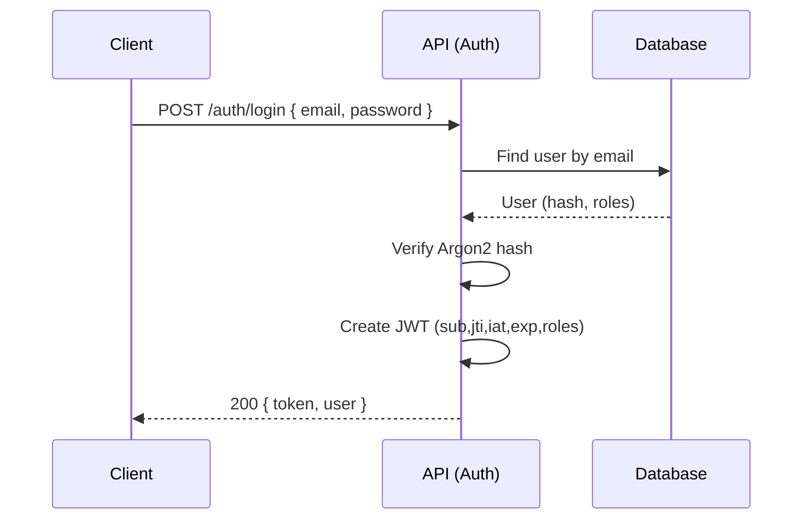
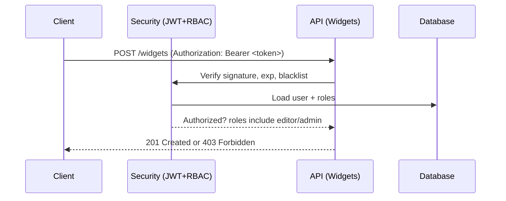

# A RBAC API Tutorial with Flask, SQLAlchemy, Argon2, and JWT (PyJWT)

In this hands-on tutorial, you’ll build a small but complete API that demonstrates authentication and role-based authorization (RBAC) in Flask using:

- Plain SQLAlchemy ORM (declarative_base)
- Argon2 (argon2-cffi) for password hashing
- PyJWT for JSON Web Tokens (JWT)
- Marshmallow for validation and serialization
- Flasgger for minimal, discoverable API docs
- SQLite for development

You will end up with a runnable API, a Swagger UI, minimal tests, and a Postman collection. Each section explains the “what” and the “why” so you can adapt these patterns to your own projects.

Scope and design constraints
- We keep a tiny domain (Users, Roles, Widgets) to focus on security concepts.
- Token model: a single 24-hour JWT used for all requests (we’ll call it your access token).
- Rotation endpoint (/auth/rotate) to replace a token and revoke the old one.
- Fixed roles: admin, editor, user.
  - user: read widgets
  - editor: create/update widgets
  - admin: delete widgets and manage user roles


Terminology (quick reference)
- Authentication: Verifying identity (e.g., login with email/password).
- Authorization (RBAC): Deciding what an authenticated user can do, based on roles.
- JWT: A signed token containing claims (like user id, roles, expiry).
- Argon2: A memory-hard hashing algorithm for storing passwords securely.
- Serialization vs Deserialization: Marshmallow “dump” serializes Python objects to JSON; “load” deserializes and validates incoming JSON to Python data.

- Login flow diagram: 
- Protected request + RBAC diagram: 
- Swagger UI screenshot: 

---

## 1) Project Setup

The tools we will be using
- Flask: a minimal web framework that lets us see every moving part.
- SQLAlchemy ORM (plain): control over engine, sessions, and patterns.
- Argon2: modern password hashing (resists GPU/ASIC attacks better than older hashes).
- PyJWT: simple, explicit control over token claims and signing.
- Marshmallow: clean schema-based validation; separates input validation from model definitions.
- Flasgger: quick Swagger UI without coupling to frameworks.
- SQLite: zero-config DB for development.

Create and activate a virtual environment, then install dependencies:

```bash
python -m venv .venv
source .venv/bin/activate  # Windows: .venv\Scripts\activate
pip install --upgrade pip
pip install Flask SQLAlchemy PyJWT argon2-cffi marshmallow flasgger python-dotenv pytest
```

Create a .env to centralize environment variables (python-dotenv loads it):

```env
FLASK_ENV=development
JWT_SECRET=dev-please-change-me
DATABASE_URL=sqlite:///instance/app.db
ADMIN_DEFAULT_EMAIL=admin@example.com
ADMIN_DEFAULT_PASSWORD=Admin1234!
```

codebase structure:

```
project/
  app/
    __init__.py
    config.py
    storage/
      db.py
    models/
      base.py
      user.py
      role.py
      user_role.py
      widget.py
      blacklisted_token.py
      __init__.py
    schemas/
      auth.py
      user.py
      widget.py
    api/
      auth/
        __init__.py
        routes.py
      widgets/
        __init__.py
        routes.py
      admin/
        __init__.py
        routes.py
    utils/
      auth.py     # hash/verify + decorators
      jwt.py      # issue/decode/blacklist helpers
  docs/
    auth/
      login.yml
      register.yml
      rotate.yml
      logout.yml
      me.yml
    widgets/
      list.yml
      get.yml
      create.yml
      update.yml
      delete.yml
    admin/
      list_users.yml
      assign_role.yml
      revoke_role.yml
  tests/
    conftest.py
    test_auth_flow.py
  postman/
    collection.json
  run.py
  .env
  README.md
```

---

## 2) Configuration and App Factory

Why an application factory?
- It gives you a clean, testable way to build app instances with different configs (e.g., tests vs dev).
- You can wire dependencies (DB, blueprints, etc.) in one place.

What goes in configuration?
- Database URL, JWT parameters (secret, algorithm, TTL), and dev-only defaults like the seed admin.

```python
# app/config.py
import os
from dataclasses import dataclass

try:
    from dotenv import load_dotenv
    load_dotenv()
except Exception:
    pass

@dataclass
class Config:
    FLASK_ENV: str = os.getenv("FLASK_ENV", "production")
    DEBUG: bool = FLASK_ENV == "development"

    DATABASE_URL: str = os.getenv("DATABASE_URL", "sqlite:///instance/app.db")

    JWT_SECRET: str = os.getenv("JWT_SECRET", "change-me-in-prod")
    JWT_ALG: str = "HS256"
    JWT_TTL_SECONDS: int = 24 * 60 * 60  # 24 hours

    ADMIN_DEFAULT_EMAIL: str = os.getenv("ADMIN_DEFAULT_EMAIL", "admin@example.com")
    ADMIN_DEFAULT_PASSWORD: str = os.getenv("ADMIN_DEFAULT_PASSWORD", "Admin1234!")

def load_config() -> Config:
    return Config()
```

The application factory wires storage, models, Swagger, and blueprints; it also seeds roles and a default admin in development.

```python
# app/__init__.py
from flask import Flask
from flasgger import Swagger
from app.config import load_config
from app.storage.db import DBStorage

def create_app() -> Flask:
    cfg = load_config()
    app = Flask(__name__)
    app.config.from_object(cfg)

    # Initialize storage
    storage = DBStorage(db_url=cfg.DATABASE_URL, echo=False)
    app.extensions = getattr(app, "extensions", {})
    app.extensions["storage"] = storage

    # Register models and create tables
    from app.models import (
        Base, User, Role, UserRole, Widget, BlacklistedToken,
        ROLE_ADMIN, ROLE_EDITOR, ROLE_USER, FIXED_ROLES
    )
    storage.register_models([User, Role, UserRole, Widget, BlacklistedToken])
    Base.metadata.create_all(storage._engine)

    # Seed fixed roles + default admin in development
    if app.config["FLASK_ENV"] == "development":
        from app.utils.auth import hash_password
        sess = storage.session

        existing = {r.name for r in sess.query(Role).all()}
        for rname in FIXED_ROLES:
            if rname not in existing:
                sess.add(Role(name=rname))
        sess.commit()

        admin_email = app.config["ADMIN_DEFAULT_EMAIL"]
        admin = sess.query(User).filter_by(email=admin_email).one_or_none()
        if admin is None:
            admin = User(email=admin_email, password_hash=hash_password(app.config["ADMIN_DEFAULT_PASSWORD"]))
            sess.add(admin)
            sess.commit()
            admin_role = sess.query(Role).filter_by(name=ROLE_ADMIN).one()
            admin.roles.append(admin_role)
            sess.commit()

    # Blueprints
    from app.api.auth import bp as auth_bp
    from app.api.widgets import bp as widgets_bp
    from app.api.admin import bp as admin_bp
    app.register_blueprint(auth_bp, url_prefix="/auth")
    app.register_blueprint(widgets_bp, url_prefix="/widgets")
    app.register_blueprint(admin_bp, url_prefix="/admin")

    # Swagger / Flasgger
    swagger_template = {
        "swagger": "2.0",
        "info": {
            "title": "RBAC API (Flask + SQLAlchemy + JWT + Argon2)",
            "version": "1.0.0",
            "description": "Minimal RBAC API with single-token JWT, rotation, blacklist, and role enforcement."
        },
        "basePath": "/",
        "schemes": ["http"],
        "securityDefinitions": {
            "BearerAuth": {
                "type": "apiKey",
                "name": "Authorization",
                "in": "header",
                "description": "JWT Authorization header using the Bearer scheme. Example: 'Authorization: Bearer {token}'"
            }
        },
        "security": [{"BearerAuth": []}],
        "tags": [{"name": "auth"}, {"name": "widgets"}, {"name": "admin"}],
    }
    Swagger(app, template=swagger_template)

    @app.teardown_appcontext
    def shutdown_session(_exc=None):
        storage.close()

    return app
```

Entry point:

```python
# run.py
from app import create_app

app = create_app()

if __name__ == "__main__":
    app.run(debug=app.config.get("DEBUG", False))
```

Why teardown_appcontext?
- We use SQLAlchemy’s scoped_session. Removing/closing the session at request end avoids leaks and ensures a clean session per request thread.

---

## 3) Storage Layer (Plain SQLAlchemy)

Why use plain SQLAlchemy?
- Using plain SQLAlchemy teaches you how sessions and engines work, which helps in larger apps and different frameworks.
- You gain flexibility (e.g., custom session lifecycles, multiple engines) without framework constraints.

We create:
- A Base via declarative_base
- A DBStorage class that:
  - Manages an engine and a scoped_session
  - Provides simple CRUD-like helpers (all, get, count)
  - Registers models so all() and count() can iterate them when no class is specified

```python
# app/models/base.py
from sqlalchemy.orm import declarative_base
Base = declarative_base()
```

```python
# app/storage/db.py
from __future__ import annotations
from typing import Any, Dict, Optional, Type, Iterable
from contextlib import contextmanager

from sqlalchemy import create_engine
from sqlalchemy.orm import scoped_session, sessionmaker, Session
from app.models.base import Base

class DBStorage:
    """Plain SQLAlchemy storage with scoped_session."""
    def __init__(self, db_url: str, echo: bool = False) -> None:
        self._engine = create_engine(db_url, echo=echo, future=True)
        self._session_factory = sessionmaker(bind=self._engine, expire_on_commit=False, future=True)
        self._Session = scoped_session(self._session_factory)
        self._classes: Dict[str, Type] = {}

    @property
    def session(self) -> Session:
        return self._Session

    def register_models(self, models: Iterable[Type]) -> None:
        for m in models:
            self._classes[m.__name__] = m

    def reload(self) -> None:
        Base.metadata.create_all(self._engine)

    def close(self) -> None:
        self._Session.remove()

    def new(self, obj: Any) -> None:
        self.session.add(obj)

    def save(self) -> None:
        self.session.commit()

    def delete(self, obj: Any) -> None:
        if obj is not None:
            self.session.delete(obj)

    def all(self, cls: Optional[Type] = None) -> Dict[str, Any]:
        result: Dict[str, Any] = {}
        if cls is not None:
            for obj in self.session.query(cls).all():
                key = f"{obj.__class__.__name__}.{getattr(obj, 'id', id(obj))}"
                result[key] = obj
            return result
        for _name, model in self._classes.items():
            for obj in self.session.query(model).all():
                key = f"{obj.__class__.__name__}.{getattr(obj, 'id', id(obj))}"
                result[key] = obj
        return result

    def get(self, cls: Type, id: Any) -> Optional[Any]:
        return self.session.get(cls, id)

    def count(self, cls: Optional[Type] = None) -> int:
        if cls is not None:
            return self.session.query(cls).count()
        total = 0
        for _name, model in self._classes.items():
            total += self.session.query(model).count()
        return total

    @contextmanager
    def transaction(self):
        try:
            yield
            self.save()
        except:
            self.session.rollback()
            raise
```

Key point about scoped_session
- It provides a “session-per-thread” pattern automatically. In web apps, this maps well to “session per request” when you remove it on teardown (as we did).

---

## 4) Models and Relationships

Why these tables?
- User: identity with unique email and hashed password. Timestamps are helpful for auditing.
- Role: fixed names (“admin”, “editor”, “user”). We don’t expose dynamic permissions to keep this simple.
- UserRole: many-to-many association (a user can belong to multiple roles).
- Widget: a simple protected resource to demonstrate RBAC.
- BlacklistedToken: stores revoked token IDs (jti) to support logout and token rotation.

Many-to-many explained
- A User has many Roles through UserRole.
- A Role can be assigned to many Users.
- The association table (user_roles) has a composite PK (user_id, role_id) and a uniqueness constraint to avoid duplicates.

```python
# app/models/role.py
from sqlalchemy import Column, Integer, String
from sqlalchemy.orm import relationship
from app.models.base import Base

ROLE_ADMIN = "admin"
ROLE_EDITOR = "editor"
ROLE_USER = "user"
FIXED_ROLES = (ROLE_ADMIN, ROLE_EDITOR, ROLE_USER)

class Role(Base):
    __tablename__ = "roles"
    id = Column(Integer, primary_key=True)
    name = Column(String(32), unique=True, nullable=False)
    users = relationship("User", secondary="user_roles", back_populates="roles")
```

```python
# app/models/user_role.py
from sqlalchemy import Column, Integer, ForeignKey, UniqueConstraint
from app.models.base import Base

class UserRole(Base):
    __tablename__ = "user_roles"
    user_id = Column(Integer, ForeignKey("users.id", ondelete="CASCADE"), primary_key=True)
    role_id = Column(Integer, ForeignKey("roles.id", ondelete="CASCADE"), primary_key=True)
    __table_args__ = (UniqueConstraint("user_id", "role_id", name="uq_user_role"),)
```

```python
# app/models/user.py
from datetime import datetime
from sqlalchemy import Column, Integer, String, Text, DateTime
from sqlalchemy.orm import relationship
from app.models.base import Base

class User(Base):
    __tablename__ = "users"
    id = Column(Integer, primary_key=True)
    email = Column(String(255), unique=True, index=True, nullable=False)
    password_hash = Column(Text, nullable=False)
    created_at = Column(DateTime, default=datetime.utcnow, nullable=False)
    updated_at = Column(DateTime, default=datetime.utcnow, onupdate=datetime.utcnow, nullable=False)
    roles = relationship("Role", secondary="user_roles", back_populates="users")
```

```python
# app/models/widget.py
from datetime import datetime
from sqlalchemy import Column, Integer, String, Text, DateTime
from app.models.base import Base

class Widget(Base):
    __tablename__ = "widgets"
    id = Column(Integer, primary_key=True)
    name = Column(String(120), nullable=False)
    description = Column(Text, default="")
    created_at = Column(DateTime, default=datetime.utcnow, nullable=False)
    updated_at = Column(DateTime, default=datetime.utcnow, onupdate=datetime.utcnow, nullable=False)
```

```python
# app/models/blacklisted_token.py
from datetime import datetime
from sqlalchemy import Column, Integer, String, DateTime, ForeignKey
from app.models.base import Base

class BlacklistedToken(Base):
    __tablename__ = "blacklisted_token"
    jti = Column(String(64), primary_key=True)  # UUID4 hex
    user_id = Column(Integer, ForeignKey("users.id", ondelete="CASCADE"), nullable=False)
    expires_at = Column(DateTime, nullable=False)
    created_at = Column(DateTime, default=datetime.utcnow, nullable=False)
```

```python
# app/models/__init__.py
from app.models.base import Base
from app.models.user import User
from app.models.role import Role, ROLE_ADMIN, ROLE_EDITOR, ROLE_USER, FIXED_ROLES
from app.models.user_role import UserRole
from app.models.widget import Widget
from app.models.blacklisted_token import BlacklistedToken

__all__ = [
    "Base", "User", "Role", "UserRole", "Widget", "BlacklistedToken",
    "ROLE_ADMIN", "ROLE_EDITOR", "ROLE_USER", "FIXED_ROLES",
]
```

---

## 5) Security Utilities: Argon2 and JWT

Why Argon2?
- Passwords must never be stored in plaintext.
- Argon2 applies CPU and memory cost, making brute-force attacks harder than older hashes.

Why a single “access” token?
- For a learning project, one token keeps the flow simple:
  - Issue token at login
  - Use it for all requests (Authorization: Bearer &lt;token&gt;)
  - Rotate manually via /auth/rotate to get a fresh token (revoking the old)
- In larger systems, you’d often use short-lived access tokens and longer-lived refresh tokens with rotation. Here you get the rotation concept without the extra token type.

We implement:
- Hash and verify helpers for passwords
- require_auth decorator to parse/verify JWT, check blacklist, load user, and inject context
- require_roles to assert role membership

```python
# app/utils/auth.py
from __future__ import annotations
from functools import wraps
from typing import Callable, Iterable, Optional, Set

from flask import request, jsonify, g, current_app
from argon2 import PasswordHasher
from argon2.exceptions import VerifyMismatchError
from app.models.user import User
from app.utils.jwt import decode_token, is_revoked

ph = PasswordHasher()  # defaults

def hash_password(plain: str) -> str:
    return ph.hash(plain)

def verify_password(hash_: str, plain: str) -> bool:
    try:
        return ph.verify(hash_, plain)
    except VerifyMismatchError:
        return False

def _get_storage():
    return current_app.extensions["storage"]

def _parse_bearer_token() -> Optional[str]:
    auth = request.headers.get("Authorization", "")
    parts = auth.split()
    if len(parts) == 2 and parts[0] == "Bearer":
        return parts[1]
    return None

def require_auth(fn: Callable):
    @wraps(fn)
    def wrapper(*args, **kwargs):
        token = _parse_bearer_token()
        if not token:
            return jsonify({"error": "Missing or invalid Authorization header"}), 401
        try:
            payload = decode_token(token)
        except Exception:
            return jsonify({"error": "Invalid or expired token"}), 401

        jti = payload.get("jti")
        sub = payload.get("sub")
        if not jti or not sub:
            return jsonify({"error": "Invalid token payload"}), 401

        storage = _get_storage()
        if is_revoked(storage, jti):
            return jsonify({"error": "Token has been revoked"}), 401

        user: Optional[User] = storage.session.get(User, sub)
        if not user:
            return jsonify({"error": "User not found"}), 401

        g.current_user = user
        g.current_roles = {r.name for r in user.roles}
        g.jwt_payload = payload
        return fn(*args, **kwargs)
    return wrapper

def require_roles(*roles: Iterable[str]):
    required: Set[str] = set(roles)
    def decorator(fn: Callable):
        @wraps(fn)
        def wrapper(*args, **kwargs):
            if not hasattr(g, "current_roles"):
                return jsonify({"error": "Unauthorized"}), 401
            if g.current_roles.isdisjoint(required):
                return jsonify({"error": "Forbidden: insufficient role"}), 403
            return fn(*args, **kwargs)
        return wrapper
    return decorator
```

JWT helpers: we include claims sub (user id), jti (token id), iat/exp (issued/expiry), and roles. Blacklist entries store jti until expiry.

```python
# app/utils/jwt.py
from __future__ import annotations
from datetime import datetime, timedelta, timezone
from typing import Dict, Any

import jwt
from uuid import uuid4
from flask import current_app
from app.models.blacklisted_token import BlacklistedToken

def _utcnow() -> datetime:
    return datetime.now(timezone.utc)

def generate_jti() -> str:
    return uuid4().hex

def issue_token(user_id: int, roles: list[str]) -> str:
    secret = current_app.config["JWT_SECRET"]
    alg = current_app.config.get("JWT_ALG", "HS256")
    ttl = int(current_app.config.get("JWT_TTL_SECONDS", 24 * 3600))

    iat = _utcnow()
    exp = iat + timedelta(seconds=ttl)
    jti = generate_jti()

    payload: Dict[str, Any] = {
        "sub": user_id,
        "jti": jti,
        "iat": int(iat.timestamp()),
        "exp": int(exp.timestamp()),
        "roles": roles,
    }
    return jwt.encode(payload, secret, algorithm=alg)

def decode_token(token: str) -> Dict[str, Any]:
    secret = current_app.config["JWT_SECRET"]
    alg = current_app.config.get("JWT_ALG", "HS256")
    return jwt.decode(token, secret, algorithms=[alg])

def is_revoked(storage, jti: str) -> bool:
    return storage.session.get(BlacklistedToken, jti) is not None

def revoke_token(storage, jti: str, user_id: int, exp_ts: int) -> None:
    expires_at = datetime.fromtimestamp(exp_ts, tz=timezone.utc)
    sess = storage.session
    if not sess.get(BlacklistToken, jti):
        sess.add(BlacklistedToken(jti=jti, user_id=user_id, expires_at=expires_at))
        sess.commit()
```

Why blacklist?
- JWTs are stateless. To “log out” or invalidate a token before it expires, you need a denylist of jtis to reject on future requests.

---

## 6) Marshmallow Schemas

Why Marshmallow?
- Keeps validation and serialization concerns outside your models.
- Makes input constraints visible at the API boundary.
- Separates output shape from internal data structures (e.g., never dump password_hash).

We define:
- RegisterSchema and LoginSchema for input validation
- TokenResponseSchema and UserOutSchema for responses
- Widget schemas for input/output

```python
# app/schemas/auth.py
from marshmallow import Schema, fields, validates, ValidationError
from app.schemas.user import UserOutSchema

class RegisterSchema(Schema):
    email = fields.Email(required=True)
    password = fields.String(required=True, load_only=True)

    @validates("password")
    def validate_password(self, value: str, **kwargs):
        if len(value) < 8:
            raise ValidationError("Password must be at least 8 characters long.")

class LoginSchema(Schema):
    email = fields.Email(required=True)
    password = fields.String(required=True, load_only=True)

class TokenResponseSchema(Schema):
    token = fields.String(required=True)
    user = fields.Nested(UserOutSchema, required=True)
```

```python
# app/schemas/user.py
from marshmallow import Schema, fields

class UserOutSchema(Schema):
    id = fields.Integer()
    email = fields.Email()
    roles = fields.List(fields.String())
    created_at = fields.DateTime()
    updated_at = fields.DateTime()
```

```python
# app/schemas/widget.py
from marshmallow import Schema, fields

class WidgetInSchema(Schema):
    name = fields.String(required=True)
    description = fields.String(load_default="")

class WidgetOutSchema(Schema):
    id = fields.Integer()
    name = fields.String()
    description = fields.String()
    created_at = fields.DateTime()
    updated_at = fields.DateTime()
```

Tip: Use load for incoming data (validates and returns Python types), dump for outgoing JSON.

---

## 7) Blueprints and Routes

Why blueprints?
- Keep features separate (auth, widgets, admin).
- Scales better as the API grows.

Initialize blueprint packages:

```python
# app/api/auth/__init__.py
from flask import Blueprint
bp = Blueprint("auth", __name__)
from . import routes  # noqa
```

```python
# app/api/widgets/__init__.py
from flask import Blueprint
bp = Blueprint("widgets", __name__)
from . import routes  # noqa
```

```python
# app/api/admin/__init__.py
from flask import Blueprint
bp = Blueprint("admin", __name__)
from . import routes  # noqa
```

Auth routes (register/login/rotate/logout/me). Design choices:
- Register assigns the “user” role by default (if seeded).
- Login issues a JWT embedding current roles (authoritative roles are still checked from DB during requests).
- Rotate blacklists the old jti and issues a new token (useful for key rotation or refreshing user’s roles).
- Logout blacklists the current token.

```python
# app/api/auth/routes.py
from __future__ import annotations
from flask import request, jsonify, g, current_app
from flasgger import swag_from
from pathlib import Path
from app.api.auth import bp
from app.schemas.auth import RegisterSchema, LoginSchema, TokenResponseSchema
from app.schemas.user import UserOutSchema
from app.utils.auth import hash_password, verify_password, require_auth
from app.utils.jwt import issue_token, revoke_token
from app.models import User, Role, ROLE_USER

DOCS_DIR = Path(__file__).resolve().parents[3] / "docs"

register_schema = RegisterSchema()
login_schema = LoginSchema()
user_out = UserOutSchema()
token_out = TokenResponseSchema()

def _storage():
    return current_app.extensions["storage"]

@bp.post("/register")
@swag_from(str(DOCS_DIR / "auth" / "register.yml"))
def register():
    payload = request.get_json(silent=True) or {}
    data = register_schema.load(payload)
    sess = _storage().session

    if sess.query(User).filter_by(email=data["email"]).first():
        return jsonify({"error": "Email already in use"}), 400

    user = User(email=data["email"], password_hash=hash_password(data["password"]))
    role_user = sess.query(Role).filter_by(name=ROLE_USER).one_or_none()
    if role_user:
        user.roles.append(role_user)

    sess.add(user)
    sess.commit()
    return user_out.dump(user), 201

@bp.post("/login")
@swag_from(str(DOCS_DIR / "auth" / "login.yml"))
def login():
    payload = request.get_json(silent=True) or {}
    data = login_schema.load(payload)
    sess = _storage().session

    user = sess.query(User).filter_by(email=data["email"]).one_or_none()
    if not user or not verify_password(user.password_hash, data["password"]):
        return jsonify({"error": "Invalid credentials"}), 401

    roles = [r.name for r in user.roles]
    token = issue_token(user_id=user.id, roles=roles)
    return token_out.dump({"token": token, "user": user}), 200

@bp.post("/rotate")
@require_auth
@swag_from(str(DOCS_DIR / "auth" / "rotate.yml"))
def rotate():
    current = g.jwt_payload
    user = g.current_user
    revoke_token(_storage(), jti=current["jti"], user_id=user.id, exp_ts=current["exp"])
    roles = [r.name for r in user.roles]
    token = issue_token(user_id=user.id, roles=roles)
    return token_out.dump({"token": token, "user": user}), 200

@bp.post("/logout")
@require_auth
@swag_from(str(DOCS_DIR / "auth" / "logout.yml"))
def logout():
    current = g.jwt_payload
    user = g.current_user
    revoke_token(_storage(), jti=current["jti"], user_id=user.id, exp_ts=current["exp"])
    return jsonify({"message": "Logged out"}), 200

@bp.get("/me")
@require_auth
@swag_from(str(DOCS_DIR / "auth" / "me.yml"))
def me():
    return user_out.dump(g.current_user), 200
```

Widget routes demonstrate RBAC:
- Any authenticated user can read
- Only editors/admins can create/update
- Only admins can delete

```python
# app/api/widgets/routes.py
from __future__ import annotations
from flask import request, jsonify, current_app
from pathlib import Path
from flasgger import swag_from
from app.api.widgets import bp
from app.utils.auth import require_auth, require_roles
from app.models import Widget
from app.schemas.widget import WidgetInSchema, WidgetOutSchema

DOCS_DIR = Path(__file__).resolve().parents[3] / "docs"

widget_in = WidgetInSchema()
widget_out = WidgetOutSchema()
widget_list_out = WidgetOutSchema(many=True)

def _storage():
    return current_app.extensions["storage"]

@bp.get("")
@require_auth
@swag_from(str(DOCS_DIR / "widgets" / "list.yml"))
def list_widgets():
    sess = _storage().session
    widgets = sess.query(Widget).order_by(Widget.id.asc()).all()
    return widget_list_out.dump(widgets), 200

@bp.get("/<int:widget_id>")
@require_auth
@swag_from(str(DOCS_DIR / "widgets" / "get.yml"))
def get_widget(widget_id: int):
    sess = _storage().session
    w = sess.get(Widget, widget_id)
    if not w:
        return jsonify({"error": "Not found"}), 404
    return widget_out.dump(w), 200

@bp.post("")
@require_auth
@require_roles("editor", "admin")
@swag_from(str(DOCS_DIR / "widgets" / "create.yml"))
def create_widget():
    payload = request.get_json(silent=True) or {}
    data = widget_in.load(payload)
    sess = _storage().session
    w = Widget(**data)
    sess.add(w)
    sess.commit()
    return widget_out.dump(w), 201

@bp.patch("/<int:widget_id>")
@require_auth
@require_roles("editor", "admin")
@swag_from(str(DOCS_DIR / "widgets" / "update.yml"))
def update_widget(widget_id: int):
    payload = request.get_json(silent=True) or {}
    data = widget_in.load(payload, partial=True)
    sess = _storage().session
    w = sess.get(Widget, widget_id)
    if not w:
        return jsonify({"error": "Not found"}), 404
    for k, v in data.items():
        setattr(w, k, v)
    sess.commit()
    return widget_out.dump(w), 200

@bp.delete("/<int:widget_id>")
@require_auth
@require_roles("admin")
@swag_from(str(DOCS_DIR / "widgets" / "delete.yml"))
def delete_widget(widget_id: int):
    sess = _storage().session
    w = sess.get(Widget, widget_id)
    if not w:
        return jsonify({"error": "Not found"}), 404
    sess.delete(w)
    sess.commit()
    return jsonify({"message": "Deleted"}), 200
```

Admin routes let admins manage user roles and inspect users:

```python
# app/api/admin/routes.py
from __future__ import annotations
from flask import jsonify, current_app
from pathlib import Path
from flasgger import swag_from
from app.api.admin import bp
from app.utils.auth import require_auth, require_roles
from app.models import User, Role, FIXED_ROLES
from app.schemas.user import UserOutSchema

DOCS_DIR = Path(__file__).resolve().parents[3] / "docs"

user_out = UserOutSchema()
user_list_out = UserOutSchema(many=True)

def _storage():
    return current_app.extensions["storage"]

@bp.get("/users")
@require_auth
@require_roles("admin")
@swag_from(str(DOCS_DIR / "admin" / "list_users.yml"))
def list_users():
    sess = _storage().session
    users = sess.query(User).order_by(User.id.asc()).all()
    return user_list_out.dump(users), 200

@bp.post("/users/<int:user_id>/roles/<string:role_name>")
@require_auth
@require_roles("admin")
@swag_from(str(DOCS_DIR / "admin" / "assign_role.yml"))
def assign_role(user_id: int, role_name: str):
    if role_name not in FIXED_ROLES:
        return jsonify({"error": "Unknown role"}), 400
    sess = _storage().session
    user = sess.get(User, user_id)
    if not user:
        return jsonify({"error": "User not found"}), 404
    role = sess.query(Role).filter_by(name=role_name).one_or_none()
    if not role:
        return jsonify({"error": "Role not seeded"}), 400
    if role not in user.roles:
        user.roles.append(role)
        sess.commit()
    return user_out.dump(user), 200

@bp.delete("/users/<int:user_id>/roles/<string:role_name>")
@require_auth
@require_roles("admin")
@swag_from(str(DOCS_DIR / "admin" / "revoke_role.yml"))
def revoke_role(user_id: int, role_name: str):
    if role_name not in FIXED_ROLES:
        return jsonify({"error": "Unknown role"}), 400
    sess = _storage().session
    user = sess.get(User, user_id)
    if not user:
        return jsonify({"error": "User not found"}), 404
    role = sess.query(Role).filter_by(name=role_name).one_or_none()
    if not role:
        return jsonify({"error": "Role not seeded"}), 400
    if role in user.roles:
        user.roles.remove(role)
        sess.commit()
    return user_out.dump(user), 200
```

---

## 8) Swagger Docs (Flasgger YAML)

Why YAML per endpoint?
- Keeps route code clean and specs easy to update.
- Flasgger reads YAML and renders Swagger UI at /apidocs.


```yaml
# docs/auth/login.yml
tags:
  - auth
summary: Login and receive a JWT token
parameters:
  - in: body
    name: body
    required: true
    schema:
      type: object
      required: [email, password]
      properties:
        email:
          type: string
          format: email
        password:
          type: string
responses:
  "200":
    description: OK
  "401":
    description: Invalid credentials
```

```yaml
# docs/auth/register.yml
tags:
  - auth
summary: Register a new user
parameters:
  - in: body
    name: body
    required: true
    schema:
      type: object
      required: [email, password]
      properties:
        email:
          type: string
          format: email
        password:
          type: string
          minLength: 8
responses:
  "201":
    description: Created
  "400":
    description: Email already in use
```

```yaml
# docs/auth/rotate.yml
tags:
  - auth
summary: Rotate current token (revoke old and issue new)
security:
  - BearerAuth: []
responses:
  "200":
    description: OK
  "401":
    description: Unauthorized
```

```yaml
# docs/auth/logout.yml
tags:
  - auth
summary: Logout by revoking current token
security:
  - BearerAuth: []
responses:
  "200":
    description: Logged out
  "401":
    description: Unauthorized
```

```yaml
# docs/widgets/create.yml
tags:
  - widgets
summary: Create a widget (editor or admin)
security:
  - BearerAuth: []
parameters:
  - in: body
    name: body
    required: true
    schema:
      type: object
      required: [name]
      properties:
        name:
          type: string
        description:
          type: string
responses:
  "201":
    description: Created
  "403":
    description: Forbidden
  "401":
    description: Unauthorized
```

```yaml
# docs/widgets/list.yml
tags:
  - widgets
summary: List widgets
security:
  - BearerAuth: []
responses:
  "200":
    description: OK
  "401":
    description: Unauthorized
```

```yaml
# docs/widgets/get.yml
tags:
  - widgets
summary: Get a widget by id
security:
  - BearerAuth: []
parameters:
  - in: path
    name: widget_id
    required: true
    type: integer
responses:
  "200":
    description: OK
  "404":
    description: Not found
  "401":
    description: Unauthorized
```

```yaml
# docs/widgets/update.yml
tags:
  - widgets
summary: Update a widget (editor or admin)
security:
  - BearerAuth: []
parameters:
  - in: path
    name: widget_id
    required: true
    type: integer
  - in: body
    name: body
    required: true
    schema:
      type: object
      properties:
        name:
          type: string
        description:
          type: string
responses:
  "200":
    description: OK
  "404":
    description: Not found
  "403":
    description: Forbidden
  "401":
    description: Unauthorized
```

```yaml
# docs/widgets/delete.yml
tags:
  - widgets
summary: Delete a widget (admin only)
security:
  - BearerAuth: []
parameters:
  - in: path
    name: widget_id
    required: true
    type: integer
responses:
  "200":
    description: Deleted
  "404":
    description: Not found
  "403":
    description: Forbidden
  "401":
    description: Unauthorized
```

```yaml
# docs/admin/assign_role.yml
tags:
  - admin
summary: Assign role to a user (admin)
security:
  - BearerAuth: []
parameters:
  - in: path
    name: user_id
    required: true
    type: integer
  - in: path
    name: role_name
    required: true
    type: string
    enum: [admin, editor, user]
responses:
  "200":
    description: OK
  "400":
    description: Unknown role or not seeded
  "401":
    description: Unauthorized
  "403":
    description: Forbidden
  "404":
    description: User not found
```

```yaml
# docs/admin/revoke_role.yml
tags:
  - admin
summary: Revoke role from a user (admin)
security:
  - BearerAuth: []
parameters:
  - in: path
    name: user_id
    required: true
    type: integer
  - in: path
    name: role_name
    required: true
    type: string
    enum: [admin, editor, user]
responses:
  "200":
    description: OK
  "400":
    description: Unknown role or not seeded
  "401":
    description: Unauthorized
  "403":
    description: Forbidden
  "404":
    description: User not found
```

```yaml
# docs/admin/list_users.yml
tags:
  - admin
summary: List users (admin)
security:
  - BearerAuth: []
responses:
  "200":
    description: OK
  "401":
    description: Unauthorized
  "403":
    description: Forbidden
```


---

## 9) Testing (pytest)

Why test now?
- Verifies the end-to-end flow (register, login, protected access).
- Proves role enforcement and token revocation work.
- Makes refactoring safer.

We create a temporary SQLite DB per test session and test the core scenarios.

```python
# tests/conftest.py
import os
import tempfile
import pytest
from app import create_app

@pytest.fixture(scope="session")
def app():
    db_fd, db_path = tempfile.mkstemp(suffix=".db")
    os.close(db_fd)
    os.environ["FLASK_ENV"] = "development"
    os.environ["JWT_SECRET"] = "test-secret"
    os.environ["DATABASE_URL"] = f"sqlite:///{db_path}"
    os.environ["ADMIN_DEFAULT_EMAIL"] = "admin@example.com"
    os.environ["ADMIN_DEFAULT_PASSWORD"] = "Admin1234!"
    app = create_app()
    yield app
    try: os.remove(db_path)
    except OSError: pass

@pytest.fixture()
def client(app):
    return app.test_client()
```

```python
# tests/test_auth_flow.py
def auth_header(token: str):
    return {"Authorization": f"Bearer {token}"}

def test_register_login_me_list_widgets(client):
    r = client.post("/auth/register", json={"email": "u1@example.com", "password": "password8"})
    assert r.status_code == 201

    r = client.post("/auth/login", json={"email": "u1@example.com", "password": "password8"})
    assert r.status_code == 200
    token = r.get_json()["token"]

    r = client.get("/auth/me", headers=auth_header(token))
    assert r.status_code == 200
    assert r.get_json()["email"] == "u1@example.com"

    r = client.get("/widgets", headers=auth_header(token))
    assert r.status_code == 200

def test_rbac_rotate_logout(client):
    # admin login
    r = client.post("/auth/login", json={"email": "admin@example.com", "password": "Admin1234!"})
    assert r.status_code == 200
    admin_token = r.get_json()["token"]

    # register new user
    r = client.post("/auth/register", json={"email": "u2@example.com", "password": "password8"})
    assert r.status_code == 201
    user_id = r.get_json()["id"]

    # user login
    r = client.post("/auth/login", json={"email": "u2@example.com", "password": "password8"})
    assert r.status_code == 200
    token = r.get_json()["token"]

    # user cannot create widget yet
    r = client.post("/widgets", json={"name": "W1"}, headers=auth_header(token))
    assert r.status_code in (401, 403)

    # admin assigns editor role
    r = client.post(f"/admin/users/{user_id}/roles/editor", headers=auth_header(admin_token))
    assert r.status_code == 200

    # user can now create
    r = client.post("/widgets", json={"name": "W2"}, headers=auth_header(token))
    assert r.status_code == 201

    # rotate token
    r = client.post("/auth/rotate", headers=auth_header(token))
    assert r.status_code == 200
    new_token = r.get_json()["token"]

    # old token is revoked
    r = client.get("/widgets", headers=auth_header(token))
    assert r.status_code == 401

    # new token works
    r = client.get("/widgets", headers=auth_header(new_token))
    assert r.status_code == 200

    # logout revokes token
    r = client.post("/auth/logout", headers=auth_header(new_token))
    assert r.status_code == 200
    r = client.get("/widgets", headers=auth_header(new_token))
    assert r.status_code == 401
```

What these tests prove
- Correct hashing, auth, and JWT issuance.
- Role enforcement on endpoints.
- Token rotation blacklists old tokens; logout blacklists current token.

---

---

## 10) Run and Explore

Quickstart

```bash
# 1) Install deps
python -m venv .venv
source .venv/bin/activate
pip install --upgrade pip
pip install Flask SQLAlchemy PyJWT argon2-cffi marshmallow flasgger python-dotenv pytest

# 2) Create .env (see earlier)
# 3) Run the app
python run.py
# 4) Open Swagger UI
# http://localhost:5000/apidocs
```

Try the flow:
- Register → Login → GET /auth/me
- As the seeded admin, grant “editor” to a user → that user can create/update widgets.
- Rotate token to see blacklisting in action.
- Logout to revoke the current token.

Production notes (at a glance)
- Use a strong JWT_SECRET and rotate it periodically.
- Serve over HTTPS.
- Consider shorter TTLs for tokens in production.
- Move from SQLite to Postgres/MySQL and introduce migrations (Alembic).
- Add CORS policy, logging, and monitoring as needed.

---

## 11) Diagrams (placeholders + Mermaid)

Static images (replace with your own):
- 
- 

Mermaid sequence diagrams:





Optional ER notes
- User —< UserRole >— Role (many-to-many)
- User —< BlacklistedToken (one-to-many by user_id)
- Widget is a standalone resource

---

## Conclusion

You’ve built a minimal, understandable RBAC API with:
- Plain SQLAlchemy (declarative_base) and a small storage layer
- Argon2 password hashing
- A single 24-hour JWT with rotation and blacklisting
- Role enforcement via decorators
- Marshmallow validation and Flasgger docs
- Tests and a Postman collection

This is a solid base to extend:
- Add Alembic migrations and a production database
- Tighten security (shorter TTLs, secret rotation, HTTPS)
- Add auditing, logging, and monitoring
- Evolve from roles to fine-grained permissions if your domain needs it